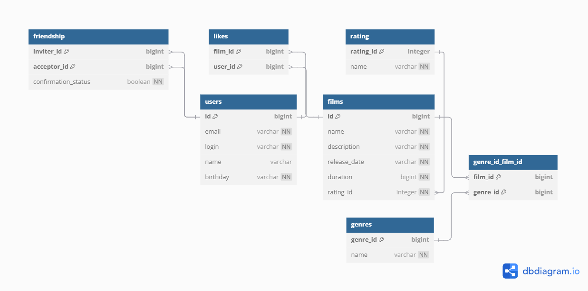

# Схема базы данных Filmorate

## ER-диаграмма


## Пояснение:
Схема базы данных для приложения Filmorate хранит информацию о фильмах, пользователях, жанрах, рейтингах, лайках и
дружбе. Она нормализована до 3NF и поддерживает основные операции приложения: получение всех фильмов и пользователей,
поиск популярных фильмов, жанров фильма и общих друзей между пользователями.

## Примеры SQL-запросов:

### Получить все фильмы
Запрос возвращает список всех фильмов из базы данных вместе с их рейтингами.
```sql
SELECT f.id, f.name, f.description, f.release_date, f.duration, r.name AS rating
FROM films f
JOIN rating r ON f.rating_id = r.rating_id;
```

### Получить всех пользователей
Запрос возвращает список всех пользователей приложения с их данными (ID, email, логин, имя, дата рождения)
```sql
SELECT id, email, login, name, birthday
FROM users;
```

### Получить топ-10 популярных фильмов
Запрос возвращает 10 фильмов, которые получили больше всего лайков от пользователей, сортируя фильмы по убыванию
популярности.
```sql
SELECT f.id, f.name, COUNT(l.user_id) AS like_count
FROM films f
LEFT JOIN likes l ON f.id = l.film_id
GROUP BY f.id, f.name
ORDER BY like_count DESC
LIMIT 10;
```

### Получить общих друзей двух пользователей
Запрос находит пользователей, которые являются друзьями сразу у двух заданных пользователей
(например, с ID 1 и 2).
```sql
SELECT u.id, u.login, u.name
FROM users u
JOIN friendship f1 ON u.id = f1.acceptor_id
JOIN friendship f2 ON u.id = f2.acceptor_id
WHERE f1.inviter_id = 1 AND f2.inviter_id = 2 AND f1.confirmation_status = true AND f2.confirmation_status = true;
```

### Получить жанры фильма
Запрос возвращает список жанров для фильма с заданным ID (в примере ID = 1)
```sql
SELECT g.name
FROM genres g
JOIN genre_id_film_id fg ON g.genre_id = fg.genre_id
WHERE fg.film_id = 1;
```
